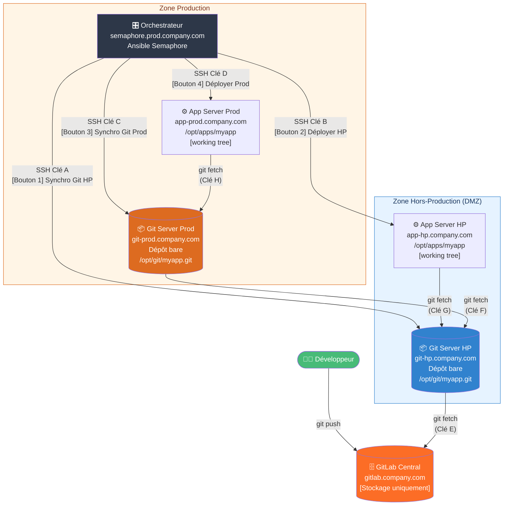
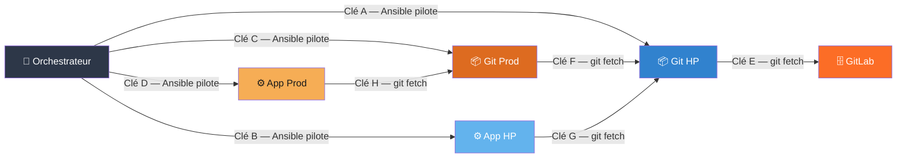
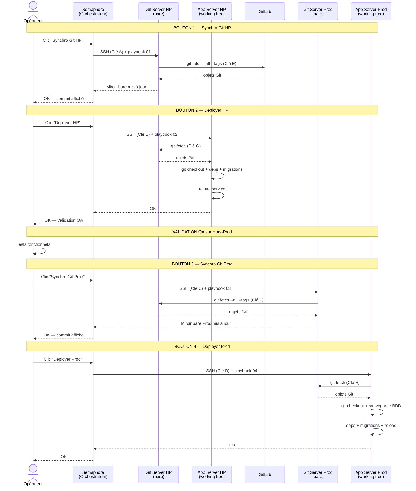

# Architecture — Pipeline de Déploiement Sécurisé

## Infrastructure : 6 serveurs distincts

| Serveur            | Hostname                  | Zone          | Rôle                                      |
|--------------------|---------------------------|---------------|-------------------------------------------|
| GitLab Central     | gitlab.company.com        | Externe/DMZ   | Stockage source de vérité (pas de CI/CD)  |
| Git Server HP      | git-hp.company.com        | Hors-Prod     | Dépôt bare, miroir de GitLab              |
| App Server HP      | app-hp.company.com        | Hors-Prod     | Application PHP/Python + working tree     |
| Git Server Prod    | git-prod.company.com      | Production    | Dépôt bare, miroir de Git HP             |
| App Server Prod    | app-prod.company.com      | Production    | Application PHP/Python + working tree     |
| Orchestrateur      | semaphore.prod.company.com| Production    | Ansible Semaphore, point d'entrée unique  |

---

## Schéma global — Vue réseau et flux de données



---

## Schéma des 8 clés SSH



| Clé | Source       | Destination  | Type accès       | Fichier clé privée (sur la source)          |
|-----|--------------|--------------|------------------|---------------------------------------------|
| A   | Orchestrateur| Git HP       | SSH Ansible      | `~/.ssh/id_orch_git_hp`                    |
| B   | Orchestrateur| App HP       | SSH Ansible      | `~/.ssh/id_orch_app_hp`                    |
| C   | Orchestrateur| Git Prod     | SSH Ansible      | `~/.ssh/id_orch_git_prod`                  |
| D   | Orchestrateur| App Prod     | SSH Ansible      | `~/.ssh/id_orch_app_prod`                  |
| E   | Git HP       | GitLab       | git (read-only)  | `/home/deploy/.ssh/id_githp_gitlab`        |
| F   | Git Prod     | Git HP       | git (read-only)  | `/home/deploy/.ssh/id_gitprod_githp`       |
| G   | App HP       | Git HP       | git (read-only)  | `/home/deploy/.ssh/id_apphp_githp`         |
| H   | App Prod     | Git Prod     | git (read-only)  | `/home/deploy/.ssh/id_appprod_gitprod`     |

---

## Schéma de séquence — Déploiement complet



---

## Nature des dépôts Git

```
Git Server HP    (/opt/git/myapp.git)   → BARE REPOSITORY
Git Server Prod  (/opt/git/myapp.git)   → BARE REPOSITORY

  Dépôt bare = uniquement les objets Git, pas de working tree.
  Sert de miroir/relais. Aucun code ne s'exécute ici.

  Contenu :
    HEAD  branches/  config  description
    hooks/  info/  objects/  packed-refs  refs/

App Server HP    (/opt/apps/myapp)      → WORKING TREE
App Server Prod  (/opt/apps/myapp)      → WORKING TREE

  Working tree = dépôt + fichiers sources visibles.
  C'est ici que le code PHP/Python s'exécute.

  Contenu :
    .git/   index.php   app/   config/   ...
```

---

## Zones réseau et flux autorisés

```
┌──────────────────────────────────────────────────────────────────────────────┐
│  ZONE PRODUCTION                                                             │
│                                                                              │
│  ┌─────────────────────┐    Clé A    ┌───────────────────────┐              │
│  │  Orchestrateur      │────────────►│  Git Server HP        │              │
│  │  (Semaphore)        │    Clé B    ├───────────────────────┤              │
│  │                     │────────────►│  App Server HP        │  ZONE HP     │
│  │                     │    Clé C    ├───────────────────────┤              │
│  │                     │────────────►│  Git Server Prod      │              │
│  │                     │    Clé D    ├───────────────────────┤              │
│  │                     │────────────►│  App Server Prod      │              │
│  └─────────────────────┘            └───────────────────────┘              │
└──────────────────────────────────────────────────────────────────────────────┘

Connexions git initiées PAR les serveurs cibles :

  Git HP   --Clé E--> GitLab   (git fetch depuis HP vers GitLab)
  Git Prod --Clé F--> Git HP   (git fetch depuis Prod vers HP)
  App HP   --Clé G--> Git HP   (git fetch pour déploiement)
  App Prod --Clé H--> Git Prod (git fetch pour déploiement)

Règles firewall minimales requises :
  Orchestrateur  --> Git HP    : TCP/22
  Orchestrateur  --> App HP    : TCP/22
  Orchestrateur  --> Git Prod  : TCP/22
  Orchestrateur  --> App Prod  : TCP/22
  Git HP         --> GitLab    : TCP/22
  Git Prod       --> Git HP    : TCP/22
  App HP         --> Git HP    : TCP/22
  App Prod       --> Git Prod  : TCP/22

Tout autre flux : BLOQUE
```

---

## Décisions d'architecture

| Décision | Choix | Justification |
|----------|-------|---------------|
| Dépôts bare sur Git HP et Git Prod | `/opt/git/myapp.git` | Pas de working tree = pas de risque d'exécution accidentelle, usage pur miroir |
| Working tree sur App HP et App Prod | `/opt/apps/myapp` | Le code s'exécute directement depuis le dépôt cloné |
| La Prod ne connaît pas GitLab | Git Prod → Git HP uniquement | Isolation réseau stricte, la Prod ne peut pas aller chercher n'importe quoi |
| Fetch + Checkout (pas git pull) | `git fetch` puis `git checkout --force` | Aucun merge automatique, contrôle total sur la version déployée |
| Tags Git pour le rollback | `v1.x.y` sémantique | Rollback déterministe vers n'importe quelle version antérieure |
| 4 boutons séparés | Synchro et Deploy distincts | Validation intermédiaire entre chaque étape, pas de déploiement automatique |
| Clés SSH read-only (F, G, H) | `command=git-upload-pack` dans `authorized_keys` | Même si une clé est compromise, impossible d'ouvrir un shell ou d'écrire |
