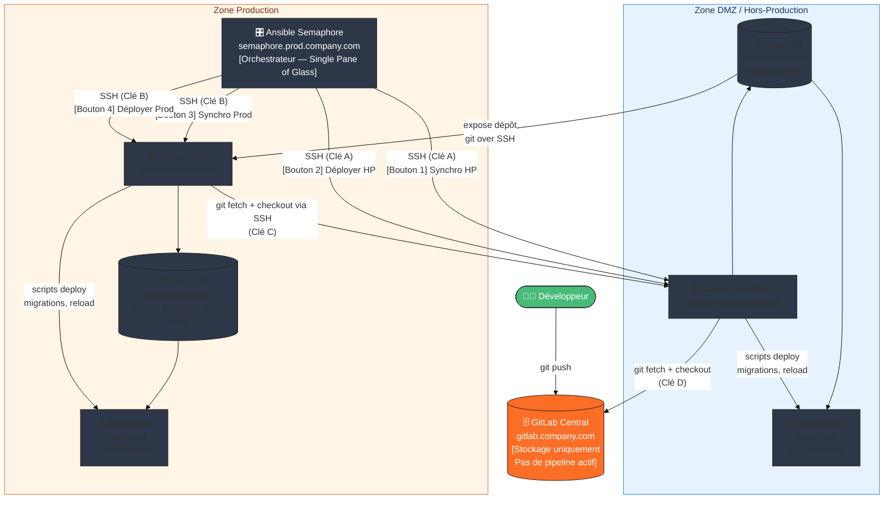
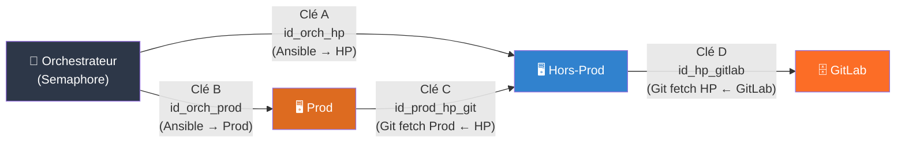
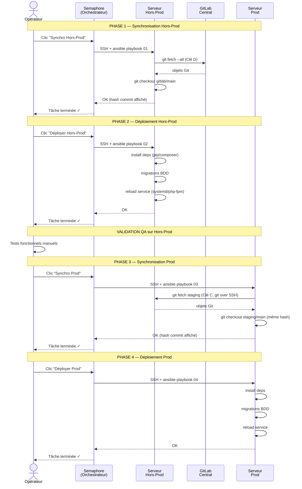
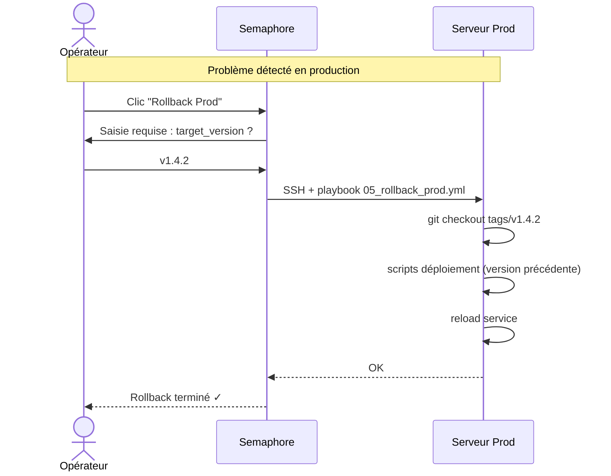

# Architecture — Pipeline de Déploiement Sécurisé

## Schéma global (vue réseau et flux de données)



---

## Schéma des clés SSH



---

## Schéma de séquence — Déploiement complet



---

## Schéma de rollback



---

## Zones réseau et flux autorisés

```
┌─────────────────────────────────────────────────────────────────────┐
│                        ZONE PRODUCTION                              │
│                                                                     │
│   ┌──────────────────────┐      ┌──────────────────────────────┐   │
│   │  Ansible Semaphore   │      │     Serveur Prod             │   │
│   │  (Orchestrateur)     │─────►│  - App PHP/Python            │   │
│   │                      │ SSH  │  - Git local #2              │   │
│   │  Port 3000 (web UI)  │  B   │  - remote: staging → HP      │   │
│   └──────────────────────┘      └──────────────────────────────┘   │
│             │                                    │ SSH (Clé C)      │
│             │ SSH (Clé A)                        │ git fetch        │
│             │                                    ▼                  │
│             │               ┌─────────────────────────────────────┐ │
└─────────────│───────────────│         ZONE HORS-PROD              │ │
              │               │                                     │ │
              └──────────────►│  Serveur Hors-Prod                  │ │
                              │  - App PHP/Python                   │ │
                              │  - Git local #1                     │ │
                              │  - remote: gitlab → GitLab          │ │
                              │             │ SSH (Clé D)           │ │
                              │             │ git fetch             │ │
                              │             ▼                       │ │
                              │       ┌──────────┐                  │ │
                              │       │  GitLab  │                  │ │
                              │       │ Central  │                  │ │
                              │       └──────────┘                  │ │
                              └─────────────────────────────────────┘ │
                                                                       │
└──────────────────────────────────────────────────────────────────────┘

Flux réseau autorisés :
  Orchestrateur → Hors-Prod  : TCP/22 (SSH)     [Clé A]
  Orchestrateur → Prod        : TCP/22 (SSH)     [Clé B]
  Prod → Hors-Prod            : TCP/22 (SSH)     [Clé C, git only]
  Hors-Prod → GitLab          : TCP/22 (SSH)     [Clé D, git only]

Flux interdits (principe du moindre privilège) :
  GitLab → tout serveur interne   : BLOQUE
  Internet → serveurs internes     : BLOQUE
  Prod → Internet                  : BLOQUE (sauf si dépôts packages internes)
```

---

## Décisions d'architecture

| Décision | Choix | Justification |
|----------|-------|---------------|
| Pas de `git pull` | `git fetch` + `git checkout` | Pas de merge automatique, contrôle total sur la version |
| Dépôts non-bare | Working tree actif | Le code est exécuté directement depuis le dépôt |
| Remote nommé `gitlab` sur HP | Pas `origin` | Clarté, évite toute ambiguïté si on ajoute des remotes |
| Remote nommé `staging` sur Prod | Pointe vers HP via SSH | Isolation réseau, la Prod ne connaît pas GitLab |
| Tags Git pour la Prod | `v1.x.y` sémantique | Rollback déterministe, traçabilité |
| Semaphore en zone Prod | Accès SSH vers HP et Prod | Un seul point d'entrée opérationnel |
| 4 boutons séparés | Synchro et Deploy distincts | Permet validation intermédiaire sans déployer automatiquement |
