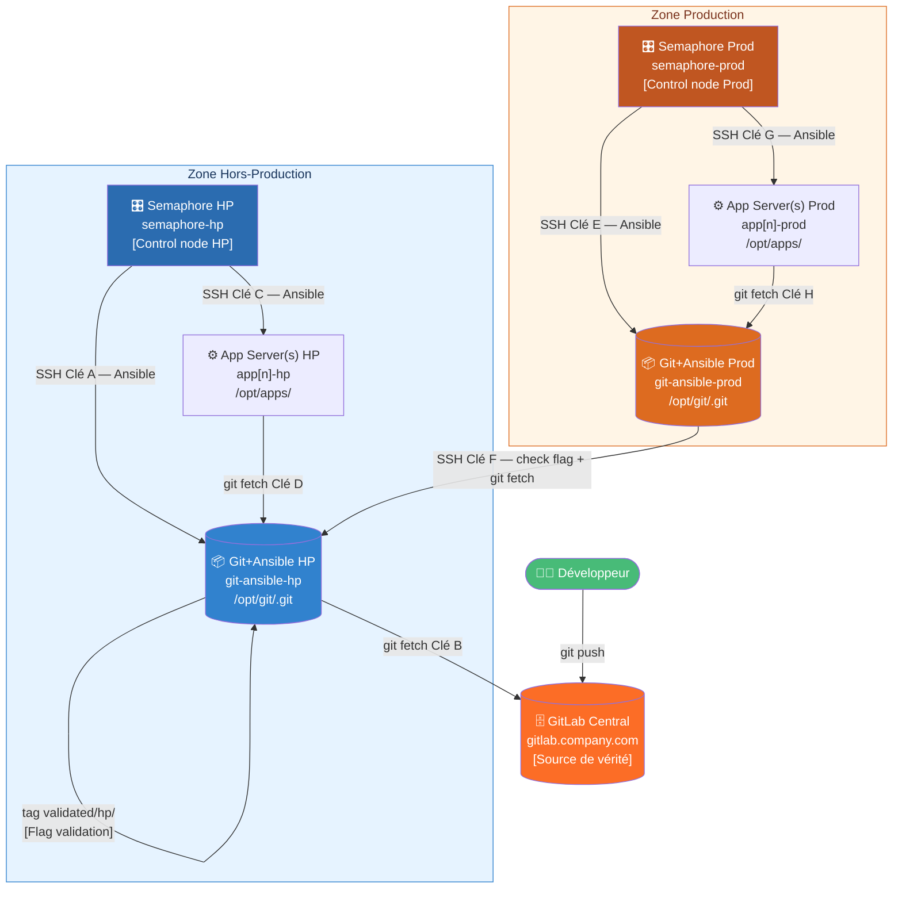
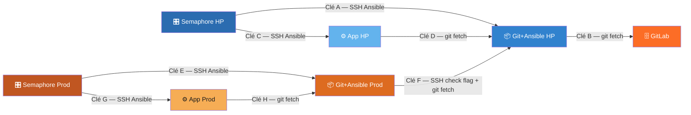
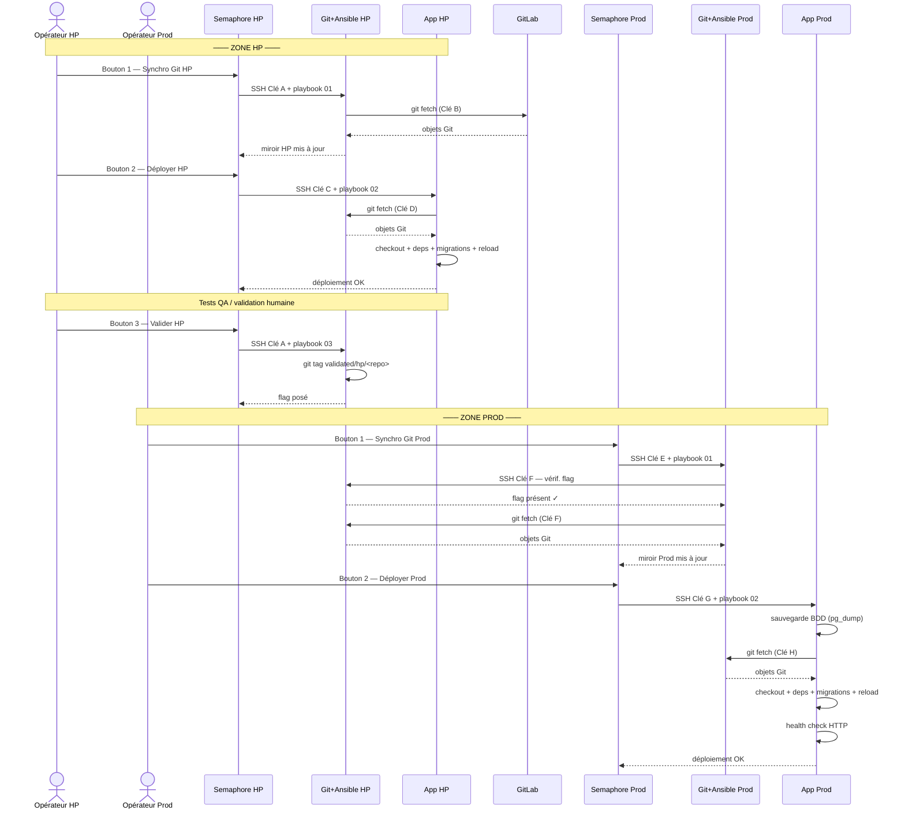

# Architecture — Pipeline de Déploiement Sécurisé

## Infrastructure : 2 zones indépendantes

| Serveur              | Hostname                      | Zone          | Rôle                                              |
|----------------------|-------------------------------|---------------|---------------------------------------------------|
| GitLab Central       | gitlab.company.com            | Externe/DMZ   | Stockage source de vérité (pas de CI/CD)          |
| Semaphore HP         | semaphore-hp.company.com      | Hors-Prod     | Semaphore UI + Ansible control node HP            |
| Git+Ansible HP       | git-ansible-hp.company.com    | Hors-Prod     | Dépôt bare miroir + Ansible installé              |
| App Server(s) HP     | app[n]-hp.company.com         | Hors-Prod     | N serveurs applicatifs HP (PHP/Python)            |
| Semaphore Prod       | semaphore-prod.company.com    | Production    | Semaphore UI + Ansible control node Prod          |
| Git+Ansible Prod     | git-ansible-prod.company.com  | Production    | Dépôt bare miroir + Ansible installé              |
| App Server(s) Prod   | app[n]-prod.company.com       | Production    | N serveurs applicatifs Prod (PHP/Python)          |

> **Git+Ansible HP/Prod** : ces serveurs hébergent à la fois le dépôt bare Git
> et une installation Ansible. Semaphore se connecte dessus (SSH) pour lancer
> les opérations git ; les serveurs App se connectent dessus pour fetcher le code.

---

## Schéma global — Vue réseau et flux de données



---

## Les 8 clés SSH



| Clé | Source           | Destination      | Type accès           | Fichier clé privée (sur la source)               |
|-----|------------------|------------------|----------------------|--------------------------------------------------|
| A   | Semaphore HP     | Git+Ansible HP   | SSH Ansible          | `~/.ssh/id_semaphore_hp`                         |
| B   | Git+Ansible HP   | GitLab           | git fetch (read-only)| `/opt/keys/id_githp_gitlab`                      |
| C   | Semaphore HP     | App Server(s) HP | SSH Ansible          | `~/.ssh/id_semaphore_hp_apps`                    |
| D   | App Server(s) HP | Git+Ansible HP   | git fetch (read-only)| `/opt/keys/id_apphp_to_githp`                    |
| E   | Semaphore Prod   | Git+Ansible Prod | SSH Ansible          | `~/.ssh/id_semaphore_prod`                       |
| F   | Git+Ansible Prod | Git+Ansible HP   | SSH + git fetch      | `/opt/keys/id_gitprod_to_githp`                  |
| G   | Semaphore Prod   | App Server(s) Prod| SSH Ansible         | `~/.ssh/id_semaphore_prod_apps`                  |
| H   | App Server(s) Prod| Git+Ansible Prod| git fetch (read-only)| `/opt/keys/id_appprod_to_gitprod`                |

> Les clés D, H sont strictement read-only (`command="git-upload-pack ..."` dans `authorized_keys`).
> La clé F a accès SSH pour vérifier le flag git et pour git fetch.

---

## Les 5 boutons Semaphore

### Semaphore HP — 3 boutons

| Bouton | Playbook                       | Cible Ansible              | Action                                          |
|--------|--------------------------------|----------------------------|-------------------------------------------------|
| 1      | `hp/01_sync_git_hp.yml`        | `git_ansible_hp`           | Fetche GitLab → miroir bare HP                  |
| 2      | `hp/02_deploy_hp.yml`          | `git_ansible_hp` + App HP  | Déploie le code sur les serveurs App HP         |
| 3      | `hp/03_validate_hp.yml`        | `git_ansible_hp`           | Pose le tag `validated/hp/<repo>` sur bare HP   |

### Semaphore Prod — 2 boutons

| Bouton | Playbook                       | Cible Ansible              | Action                                          |
|--------|--------------------------------|----------------------------|-------------------------------------------------|
| 1      | `prod/01_sync_git_prod.yml`    | `git_ansible_prod`         | Vérifie flag HP, fetche Git HP → miroir bare Prod|
| 2      | `prod/02_deploy_prod.yml`      | `git_ansible_prod` + App Prod| Sauvegarde BDD + déploiement sur App Prod      |

---

## Schéma de séquence — Déploiement complet



---

## Flag de validation HP

Le **Bouton 3 HP** crée un tag git sur le dépôt bare HP :

```
validated/hp/<repo_name>    →   pointant sur le commit actuellement déployé en HP
```

Le **Bouton 1 Prod** vérifie ce flag via SSH avant tout fetch :

```bash
# Vérification depuis Git+Ansible Prod
ssh -i /opt/keys/id_gitprod_to_githp deploy@git-ansible-hp \
  "git -C /opt/git/myapp.git tag -l 'validated/hp/myapp'"
```

- **Absent** → playbook échoue avec message listant les boutons HP à exécuter
- **Présent** → fetch autorisé, commit validé affiché

Voir [docs/validation-flag.md](./validation-flag.md) pour le détail complet.

---

## Configuration par dépôt

Chaque dépôt applicatif dispose d'un fichier `ansible/repos/<repo_name>.yml` :

```yaml
# ansible/repos/myapp.yml
repo_name: myapp
git_remote_url: "git@gitlab.company.com:mygroup/myapp.git"
git_branch: main
app_type: php          # ou "python" ou "static"

app_root: "/opt/apps/myapp"
app_service_name: myapp
app_user: deploy
app_group: deploy

# Serveurs cibles (liste configurable par dépôt)
app_servers_hp:
  - app1-hp.company.com
  - app2-hp.company.com    # ajouter autant de serveurs que nécessaire

app_servers_prod:
  - app1-prod.company.com
  - app2-prod.company.com

run_migrations: true
db_host_prod: prod-db.company.com
db_name_prod: myapp_prod
db_user_prod: app_user
```

Le playbook reçoit `repo_name` comme **Survey Variable** dans Semaphore,
charge `ansible/repos/{{ repo_name }}.yml`, puis construit dynamiquement
le groupe de serveurs cibles via `add_host`.

---

## Nature des dépôts Git

```
Git+Ansible HP    (/opt/git/<repo>.git)   → BARE REPOSITORY
Git+Ansible Prod  (/opt/git/<repo>.git)   → BARE REPOSITORY

  Dépôt bare = uniquement les objets Git, pas de working tree.
  Sert de miroir/relais. Aucun code ne s'exécute ici.
  Contenu : HEAD  branches/  config  hooks/  objects/  refs/

App Server(s) HP    (/opt/apps/<repo>)    → WORKING TREE
App Server(s) Prod  (/opt/apps/<repo>)    → WORKING TREE

  Working tree = dépôt + fichiers sources visibles.
  C'est ici que le code PHP/Python s'exécute.
  Contenu : .git/   index.php   app/   config/   ...
```

---

## Zones réseau et flux autorisés

```
┌─────────────────────────────────────────────────────────────────────────┐
│  ZONE HORS-PROD                                                         │
│                                                                         │
│  ┌──────────────────┐   Clé A   ┌──────────────────────────────────┐   │
│  │  Semaphore HP    │──────────►│  Git+Ansible HP                  │   │
│  │                  │   Clé C   │  (bare /opt/git/*.git)            │   │
│  │                  │──────────►│  App Server(s) HP                │   │
│  └──────────────────┘          └──────────────────────────────────┘   │
└─────────────────────────────────────────────────────────────────────────┘

┌─────────────────────────────────────────────────────────────────────────┐
│  ZONE PROD                                                              │
│                                                                         │
│  ┌──────────────────┐   Clé E   ┌──────────────────────────────────┐   │
│  │  Semaphore Prod  │──────────►│  Git+Ansible Prod                │   │
│  │                  │   Clé G   │  (bare /opt/git/*.git)            │   │
│  │                  │──────────►│  App Server(s) Prod              │   │
│  └──────────────────┘          └──────────────────────────────────┘   │
└─────────────────────────────────────────────────────────────────────────┘

Connexions git initiées PAR les serveurs cibles (pull model) :

  Git+Ansible HP   --Clé B--> GitLab            (git fetch)
  App Server(s) HP --Clé D--> Git+Ansible HP    (git fetch)
  Git+Ansible Prod --Clé F--> Git+Ansible HP    (SSH check flag + git fetch)
  App Server(s) Prod --Clé H--> Git+Ansible Prod (git fetch)

Règles firewall minimales requises :
  Semaphore HP    --> Git+Ansible HP    : TCP/22
  Semaphore HP    --> App HP            : TCP/22
  Git+Ansible HP  --> GitLab            : TCP/22
  App HP          --> Git+Ansible HP    : TCP/22
  Semaphore Prod  --> Git+Ansible Prod  : TCP/22
  Semaphore Prod  --> App Prod          : TCP/22
  Git+Ansible Prod --> Git+Ansible HP   : TCP/22
  App Prod        --> Git+Ansible Prod  : TCP/22

Tout autre flux : BLOQUÉ
```

---

## Décisions d'architecture

| Décision | Choix | Justification |
|----------|-------|---------------|
| 2 Semaphore indépendants | Un par zone | Isolation complète HP/Prod, un incident Prod n'affecte pas HP |
| Git+Ansible combiné | Un seul serveur par zone | Simplifie la gestion des clés, le serveur git est aussi le control node |
| Dépôts bare sur Git+Ansible | `/opt/git/<repo>.git` | Pas de working tree = pas de risque d'exécution accidentelle |
| Flag de validation via git tag | `validated/hp/<repo>` | Mécanisme natif git, auditable, pas de dépendance externe |
| Pull model exclusif | Toujours `git fetch`, jamais de push vers les cibles | La Production ne peut recevoir que ce que HP a validé |
| Per-repo target lists | `app_servers_hp/prod` dans repos YAML | Flexibilité par application, pas de reconfiguration Ansible |
| Fetch + Checkout (pas git pull) | `git fetch` puis `git checkout --force` | Aucun merge automatique, contrôle total sur la version déployée |
| Rolling deploy | `serial: 1` | Déploiement serveur par serveur, le parc reste partiellement disponible |
| Clés SSH read-only (D, H) | `command="git-upload-pack ..."` dans `authorized_keys` | Même si compromises, impossible d'ouvrir un shell ou d'écrire |
| Sauvegarde BDD avant Prod | `pg_dump -Fc` avant migration | Rollback possible si migration échoue en Production |
