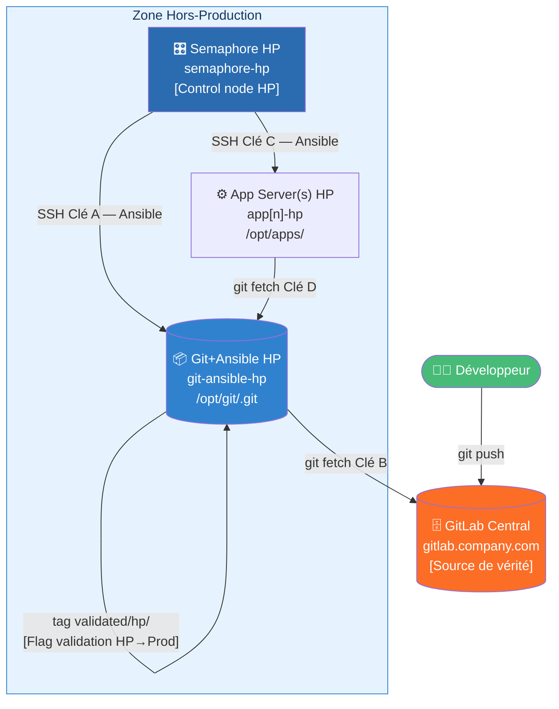
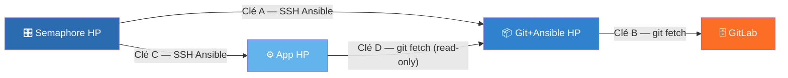
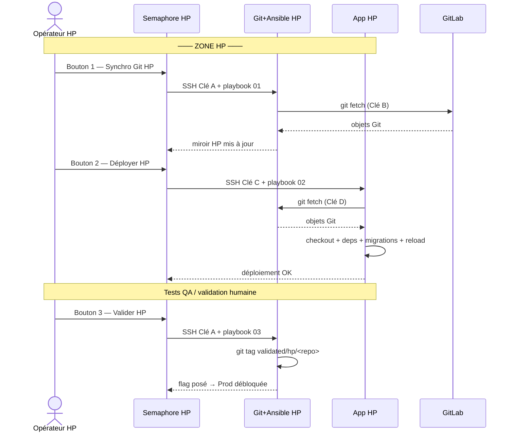

# Architecture — Zone Hors-Production (HP)

> Document dédié à la zone HP. Pour la zone Production, voir [architecture_prod.md](./architecture_prod.md).
> Pour le mécanisme de validation entre zones, voir [validation-flag.md](./validation-flag.md).

---

## Serveurs de la zone HP

| Serveur              | Hostname                      | Zone          | Rôle                                              |
|----------------------|-------------------------------|---------------|---------------------------------------------------|
| GitLab Central       | gitlab.company.com            | Externe/DMZ   | Stockage source de vérité (pas de CI/CD)          |
| Semaphore HP         | semaphore-hp.company.com      | Hors-Prod     | Semaphore UI + Ansible control node HP            |
| Git+Ansible HP       | git-ansible-hp.company.com    | Hors-Prod     | Dépôt bare miroir + Ansible installé              |
| App Server(s) HP     | app[n]-hp.company.com         | Hors-Prod     | N serveurs applicatifs HP (PHP/Python/Node.js/Java/Go) |

> **Git+Ansible HP** : ce serveur héberge à la fois le dépôt bare Git
> et une installation Ansible. Semaphore se connecte dessus (SSH) pour lancer
> les opérations git ; les serveurs App se connectent dessus pour fetcher le code.

---

## Flux réseau — Zone HP



---

## Clés SSH de la zone HP (A, B, C, D)



| Clé | Source           | Destination      | Type accès            | Fichier clé privée (sur la source)    |
|-----|------------------|------------------|-----------------------|---------------------------------------|
| A   | Semaphore HP     | Git+Ansible HP   | SSH Ansible (complet) | `~/.ssh/id_semaphore_hp`              |
| B   | Git+Ansible HP   | GitLab           | git fetch (read-only) | `/opt/keys/id_githp_gitlab`           |
| C   | Semaphore HP     | App Server(s) HP | SSH Ansible (complet) | `~/.ssh/id_semaphore_hp_apps`         |
| D   | App Server(s) HP | Git+Ansible HP   | git fetch (read-only) | `/opt/keys/id_apphp_to_githp`         |

> La clé D est strictement read-only (`command="git-upload-pack ..."` dans `authorized_keys`).
> Voir [ssh-key-management_hp.md](./ssh-key-management_hp.md) pour la configuration complète.

---

## Les 4 boutons Semaphore HP

| Bouton | Playbook                    | Cible Ansible              | Action                                          |
|--------|-----------------------------|----------------------------|-------------------------------------------------|
| 1      | `hp/01_sync_git_hp.yml`     | `git_ansible_hp`           | Fetche GitLab → miroir bare HP                  |
| 2      | `hp/02_deploy_hp.yml`       | `git_ansible_hp` + App HP  | Déploie le code sur les serveurs App HP         |
| 3      | `hp/03_validate_hp.yml`     | `git_ansible_hp`           | Pose le tag `validated/hp/<repo>` sur bare HP   |
| 4      | `hp/04_rollback_hp.yml`     | App HP                     | Retourne l'App HP à un tag ou commit précédent  |

> Le **Bouton 1 Prod est bloqué** si le Bouton 3 HP n'a pas été exécuté.
> Voir [validation-flag.md](./validation-flag.md) pour le détail.

---

## Schéma de séquence — Déploiement HP complet



---

## Configuration par dépôt (zone HP)

Chaque dépôt applicatif dispose d'un fichier `ansible/repos/<repo_name>.yml`.
Les champs HP pertinents :

```yaml
# ansible/repos/myapp.yml (extrait zone HP)
repo_name: myapp
git_remote_url: "git@gitlab.company.com:mygroup/myapp.git"
git_branch: main
app_type: php          # ou "python", "nodejs", "java", "go", "static"

app_root: "/opt/apps/myapp"
app_service_name: myapp
app_user: deploy
app_group: deploy

# Serveurs cibles HP (liste configurable par dépôt)
app_servers_hp:
  - app1-hp.company.com
  - app2-hp.company.com    # ajouter autant de serveurs que nécessaire

run_migrations: true
```

---

## Nature des dépôts Git en zone HP

```
Git+Ansible HP    (/opt/git/<repo>.git)   → BARE REPOSITORY
  Dépôt bare = uniquement les objets Git, pas de working tree.
  Sert de miroir/relais entre GitLab et App HP.
  Contenu : HEAD  branches/  config  hooks/  objects/  refs/

App Server(s) HP    (/opt/apps/<repo>)    → WORKING TREE
  Working tree = dépôt + fichiers sources visibles.
  C'est ici que le code PHP/Python/Node.js s'exécute.
  Contenu : .git/   index.php   app/   config/   ...
```

---

## Zones réseau et flux autorisés (HP)

```
┌─────────────────────────────────────────────────────────────────────────┐
│  ZONE HORS-PROD                                                         │
│                                                                         │
│  ┌──────────────────┐   Clé A   ┌──────────────────────────────────┐   │
│  │  Semaphore HP    │──────────►│  Git+Ansible HP                  │   │
│  │                  │   Clé C   │  (bare /opt/git/*.git)            │   │
│  │                  │──────────►│  App Server(s) HP                │   │
│  └──────────────────┘          └──────────────────────────────────┘   │
└─────────────────────────────────────────────────────────────────────────┘

Connexions git initiées PAR les serveurs HP (pull model) :

  Git+Ansible HP   --Clé B--> GitLab            (git fetch)
  App Server(s) HP --Clé D--> Git+Ansible HP    (git fetch)

Règles firewall minimales pour la zone HP :
  Semaphore HP    --> Git+Ansible HP    : TCP/22   AUTORISER
  Semaphore HP    --> App HP            : TCP/22   AUTORISER
  Git+Ansible HP  --> GitLab            : TCP/22   AUTORISER
  App HP          --> Git+Ansible HP    : TCP/22   AUTORISER
  Semaphore HP    --> Zone Prod         : *        BLOQUER
  Tout autre flux                       : *        BLOQUER
```

---

## Décisions d'architecture (zone HP)

| Décision | Choix | Justification |
|----------|-------|---------------|
| Semaphore HP indépendant | Instance dédiée HP | Un incident Prod n'affecte pas HP et inversement |
| Git+Ansible HP combiné | Un seul serveur | Simplifie la gestion des clés ; le serveur git est aussi le control node |
| Dépôts bare sur Git+Ansible HP | `/opt/git/<repo>.git` | Pas de working tree = pas de risque d'exécution accidentelle |
| Flag de validation via git tag | `validated/hp/<repo>` | Mécanisme natif git, auditable, pas de dépendance externe |
| Pull model exclusif | Toujours `git fetch`, jamais de push | HP ne peut recevoir que ce que GitLab a livré |
| Clé D read-only | `command="git-upload-pack ..."` | Même compromises, impossible d'ouvrir un shell ou d'écrire |
| Rolling deploy HP | `serial: 1` | Déploiement serveur par serveur, recette progressive |
