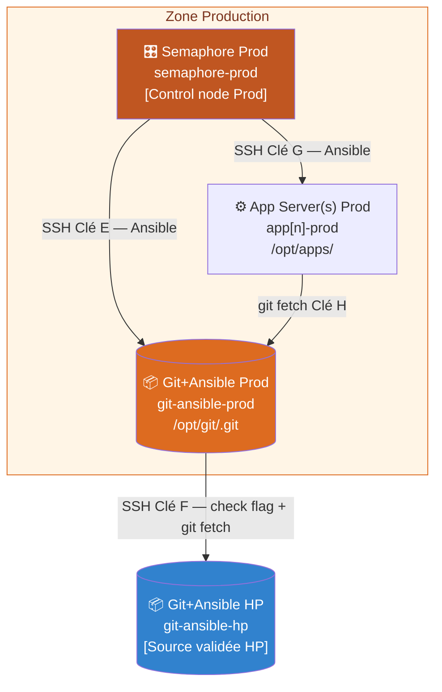
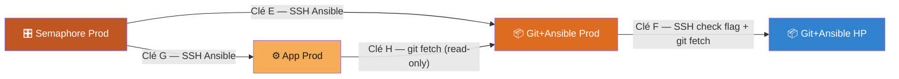
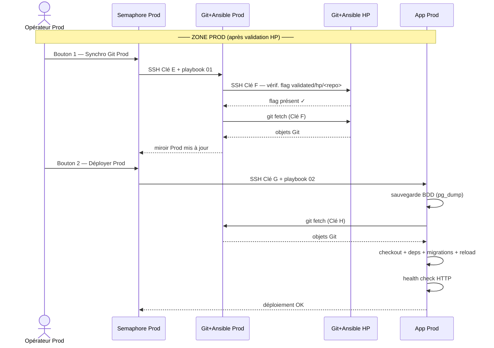

# Architecture — Zone Production (PROD)

> Document dédié à la zone Production. Pour la zone Hors-Prod, voir [architecture_hp.md](./architecture_hp.md).
> Pour le mécanisme de validation entre zones, voir [validation-flag.md](./validation-flag.md).

---

## Serveurs de la zone PROD

| Serveur              | Hostname                      | Zone          | Rôle                                              |
|----------------------|-------------------------------|---------------|---------------------------------------------------|
| GitLab Central       | gitlab.company.com            | Externe/DMZ   | Stockage source de vérité (pas de CI/CD)          |
| Git+Ansible HP       | git-ansible-hp.company.com    | Hors-Prod     | Source pour la PROD (dépôt validé)                |
| Semaphore Prod       | semaphore-prod.company.com    | Production    | Semaphore UI + Ansible control node Prod          |
| Git+Ansible Prod     | git-ansible-prod.company.com  | Production    | Dépôt bare miroir + Ansible installé              |
| App Server(s) Prod   | app[n]-prod.company.com       | Production    | N serveurs applicatifs Prod (PHP/Python/Node.js/Java/Go) |

> **Git+Ansible Prod** : ce serveur héberge à la fois le dépôt bare Git
> et une installation Ansible. La PROD ne tire que depuis Git+Ansible HP
> (jamais directement depuis GitLab), et uniquement après validation du flag HP.

---

## Flux réseau — Zone PROD



---

## Clés SSH de la zone PROD (E, F, G, H)



| Clé | Source             | Destination        | Type accès                    | Fichier clé privée (sur la source)      |
|-----|--------------------|--------------------|-------------------------------|-----------------------------------------|
| E   | Semaphore Prod     | Git+Ansible Prod   | SSH Ansible (complet)         | `~/.ssh/id_semaphore_prod`              |
| F   | Git+Ansible Prod   | Git+Ansible HP     | SSH check flag + git fetch    | `/opt/keys/id_gitprod_to_githp`         |
| G   | Semaphore Prod     | App Server(s) Prod | SSH Ansible (complet)         | `~/.ssh/id_semaphore_prod_apps`         |
| H   | App Server(s) Prod | Git+Ansible Prod   | git fetch (read-only)         | `/opt/keys/id_appprod_to_gitprod`       |

> La clé H est strictement read-only (`command="git-upload-pack ..."` dans `authorized_keys`).
> La clé F a accès SSH complet vers Git+Ansible HP pour vérifier le flag et fetcher.
> Voir [ssh-key-management_prod.md](./ssh-key-management_prod.md) pour la configuration complète.

---

## Les 3 boutons Semaphore PROD

| Bouton | Playbook                        | Cible Ansible                 | Action                                              |
|--------|---------------------------------|-------------------------------|-----------------------------------------------------|
| 1      | `prod/01_sync_git_prod.yml`     | `git_ansible_prod`            | Vérifie flag HP, fetche Git HP → miroir bare Prod   |
| 2      | `prod/02_deploy_prod.yml`       | `git_ansible_prod` + App Prod | Sauvegarde BDD + déploiement sur App Prod           |
| 3      | `prod/03_rollback_prod.yml`     | App Prod                      | Sauvegarde BDD + retour à une version précédente    |

> Le **Bouton 1 Prod est bloqué** si le Bouton 3 HP n'a pas été exécuté.
> Voir [validation-flag.md](./validation-flag.md) pour le détail.

---

## Schéma de séquence — Déploiement PROD complet



---

## Configuration par dépôt (zone PROD)

Les champs PROD pertinents du fichier `ansible/repos/<repo_name>.yml` :

```yaml
# ansible/repos/myapp.yml (extrait zone PROD)
repo_name: myapp
git_branch: main

app_root: "/opt/apps/myapp"
app_service_name: myapp
app_user: deploy
app_group: deploy

# Serveurs cibles Prod (liste configurable par dépôt)
app_servers_prod:
  - app1-prod.company.com
  - app2-prod.company.com

run_migrations: true
db_host_prod: prod-db.company.com
db_name_prod: myapp_prod
db_user_prod: app_user
```

---

## Nature des dépôts Git en zone PROD

```
Git+Ansible Prod  (/opt/git/<repo>.git)   → BARE REPOSITORY
  Dépôt bare = uniquement les objets Git, pas de working tree.
  Miroir de Git+Ansible HP, après vérification du flag.
  La PROD ne tire JAMAIS directement depuis GitLab.

App Server(s) Prod  (/opt/apps/<repo>)    → WORKING TREE
  Working tree = dépôt + fichiers sources visibles.
  C'est ici que le code de production s'exécute.
  Sauvegarde BDD (pg_dump) effectuée AVANT chaque déploiement.
```

---

## Zones réseau et flux autorisés (PROD)

```
┌─────────────────────────────────────────────────────────────────────────┐
│  ZONE PROD                                                              │
│                                                                         │
│  ┌──────────────────┐   Clé E   ┌──────────────────────────────────┐   │
│  │  Semaphore Prod  │──────────►│  Git+Ansible Prod                │   │
│  │                  │   Clé G   │  (bare /opt/git/*.git)            │   │
│  │                  │──────────►│  App Server(s) Prod              │   │
│  └──────────────────┘          └──────────────────────────────────┘   │
└─────────────────────────────────────────────────────────────────────────┘

Connexions git initiées PAR les serveurs PROD (pull model) :

  Git+Ansible Prod   --Clé F--> Git+Ansible HP    (SSH check flag + git fetch)
  App Server(s) Prod --Clé H--> Git+Ansible Prod  (git fetch)

Règles firewall minimales pour la zone PROD :
  Semaphore Prod     --> Git+Ansible Prod  : TCP/22   AUTORISER
  Semaphore Prod     --> App Prod          : TCP/22   AUTORISER
  Git+Ansible Prod   --> Git+Ansible HP    : TCP/22   AUTORISER
  App Prod           --> Git+Ansible Prod  : TCP/22   AUTORISER
  Semaphore Prod     --> Zone HP           : *        BLOQUER (sauf Git HP TCP/22)
  Tout autre flux                          : *        BLOQUER
```

---

## Décisions d'architecture (zone PROD)

| Décision | Choix | Justification |
|----------|-------|---------------|
| Semaphore Prod indépendant | Instance dédiée Prod | Isolation complète ; un incident HP n'affecte pas la Prod |
| Git+Ansible Prod combiné | Un seul serveur | Simplifie la gestion des clés ; le serveur git est aussi le control node |
| Dépôts bare sur Git+Ansible Prod | `/opt/git/<repo>.git` | Pas de working tree = pas de risque d'exécution accidentelle |
| Pull model exclusif | Toujours `git fetch`, jamais de push vers les cibles | La PROD ne peut recevoir que ce que HP a validé |
| Clé H read-only | `command="git-upload-pack ..."` | Même compromise, impossible d'ouvrir un shell ou d'écrire |
| Sauvegarde BDD avant PROD | `pg_dump -Fc` avant chaque déploiement | Rollback possible si migration échoue |
| Rolling deploy PROD | `serial: 1` | Déploiement serveur par serveur, disponibilité partielle maintenue |
| Fetch + Checkout (pas git pull) | `git fetch` puis `git checkout --force` | Aucun merge automatique, contrôle total sur la version déployée |
